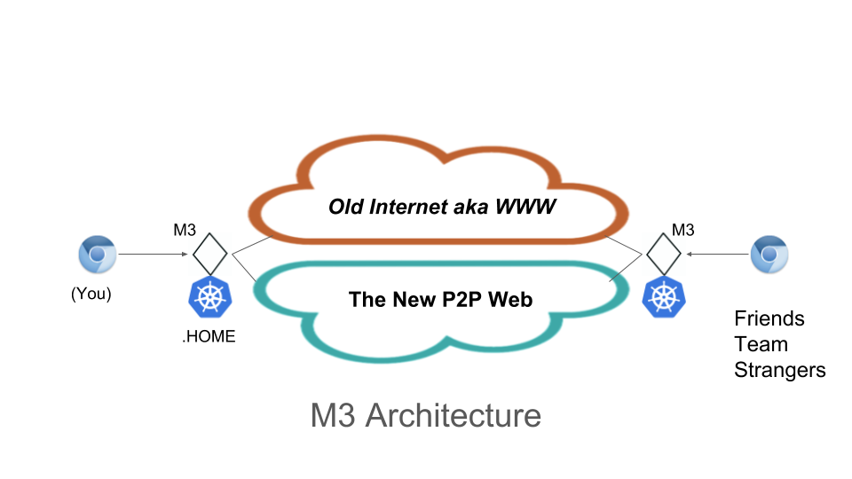

# m3

M3, MMM - the inverse of WWW (world wide web), will 
usher a new era of Internet based on peer technologies.

### Terminology

<dl>
<dt>Node</dt>
<dd>A peer host (machine, device, ...) with a unique peer ID</dd>

<dt>TLD</dt>
<dd>Top Level Domain, new (fake) domains for peer network: .home, .a, .(hex-encoded-peer-id) </dd>

<dt>Resource</dt>
<dd>Unless expressly stated, resource refers to any content or app hosted on the web or on a peer node such as but not limited to:  blog, wiki, messaging, git/repository, jenkins, sonarqube ... </dd>

<dt>URL</dt>
<dd>Uniform Resource Locator, examples: http://home for local resource on your own node, http://chat.1220848ba2cbc954d17fc1758a4dc06ec128b21c6ecc1dcfcbdc284809f4a922ba08 for slacking qiangli a message through the collaboration tool running on his node, or http://dhnt.io the classic web address</dd>
</dl>

<!-- ### Technology Stack
*Computing*

[Docker/Kubernetes](https://kubernetes.io/)

*Storage*

[Git](https://git-scm.com/)

*Peer Networking*

[IPFS](https://ipfs.io/)

*Browser/Proxy Plugin*

You may pick your favorite browser and proxy plugins. However M3 has only been tested with 
[Chrome](https://www.google.com/chrome/)
and [SwitchyOmega](https://chrome.google.com/webstore/detail/proxy-switchyomega/padekgcemlokbadohgkifijomclgjgif?hl=en)

Any browser should work and proxy plugin is optional if you change your system default proxy settings to point to M3. -->

<!-- ### What is M3, really?

- A forwarding proxy

to the old web a.k.a the Internet (as you have known it before your read this page) via your own local node or through your peers' node if you don't have direct access due to whatever reasons: technical, parental, corporate, or political.

- A reverse proxy

to the resources hosted on your own local node so you can access yourself (of course) as well as by anyone on the M3 network.
Yes, you can now host almost any contents and applications on your own node at your own terms thanks to Kubernetes/Docker container technology.

- A gateway 

to the resources hosted on the entire M3 network - the next generation of world wide wide. -->

### Getting started

M3 is still under development and no simple one-click installation available yet (sorry!).

If you are interested in trying it out, following instructions [here](doc/dev.md)

<!-- Contact us if you have questions or want to contribute. -->

<!-- 
kubectl config --kubeconfig=config-m3 set-cluster m3-k8s --server=https://host.docker.internal:6443 --insecure-skip-tls-verify

kubectl config set-cluster m3-k8s --server=https://host.docker.internal:6443 --insecure-skip-tls-verify

kubectl config set-context m3 --cluster=m3-k8s --namespace=kube-system

kubectl config use-context m3

-->

